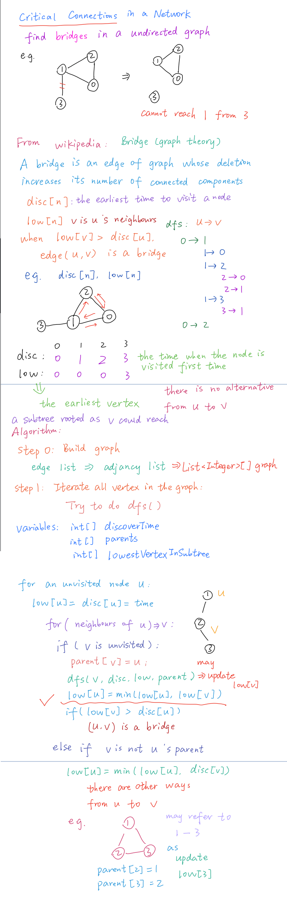

# LeetCode questions

## 2020.08.25

### 1192 Critical connection

#### My solutions

- [My solution 1](../Amazon/1192_critical_connection.java)

- [**My solution 2 best!**](../Amazon/1192_tarjan_dfs_critical_connection.java)

- [My solution 3 **My idea**](../Amazon/1192_critical_connection_solution3.java)

#### Online solutions

- [blog **best solution**](https://leetcode.jp/leetcode-1192-critical-connections-in-a-network-%E8%A7%A3%E9%A2%98%E6%80%9D%E8%B7%AF%E5%88%86%E6%9E%90/)

- [YouTube solution1](https://www.youtube.com/watch?v=kYcUIEQqL2Y)

- [YouTube solution2](https://www.youtube.com/watch?v=mKUsbABiwBI)

- [Tarjan algorithm](https://www.cnblogs.com/nullzx/p/7968110.html)

#### Steps

- 用临接表 adjancy list
  - List<Integer>[] graph
- Iterate all vertexs 
  - Try to do dfs()
  - Three variables:
    - int[] discoverTime
    - int[] parent
    - int[] lowestVertexInSubtree 
  - for unvisited node u
    - low[u] = disc[u] = time
    - for (neighbors of u) => v
    - if(v is not visited)
    - parent[v] = u
    - 递归调用，对v做dfs
    - 更新low[u] = min(low[u], low[v])
    - if(low[v] > disc[u]) -> edge(u, v) is critical connection



## 2020.09.02

### 957 Prison Cells After N Days 找规律

感觉没啥意义

#### [My solution](../Amazon/957_findPattern_prisonCellsAfterNDays.java) 

- 记录下每一步的state 
- 找到规律 例如：经过多少天就会形成 repetitive state
- 用给定step N mod C (我们找到的规律)
- N 对 C 取余数后找到对应state就是答案

#### Online solution

- [解法大全](https://massivealgorithms.blogspot.com/2019/01/leetcode-957-prison-cells-after-n-days.html)

### 973 K Closest Points to Origin

#### My solutions

- [sorting](../Amazon/973_sorting_KClosestPointsToOrigin.java)
  - 计算所有点到原点距离
  - 排序
  - 根据排序找到前k个点

- [max Heap](../Amazon/973_maxHeap_KClosestPointsToOrigin.java) ([优先队列](https://www.liaoxuefeng.com/wiki/1252599548343744/1265120632401152))
  - 求距离最近的k个值
  - 建立一个k + 1 大小的heap 然后按照距离倒序排列 形成一个max heap
  - 每次遇到一个点就放入heap 如果大于k了就弹出一个 也就是弹出距离最远的 最后剩下的就是距离最近的k个点

#### Online solutions

- [max Heap 1](http://www.noteanddata.com/leetcode-973-K-Closest-Points-to-Origin-java-solution-note.html)
- [max Heap 2](https://www.cnblogs.com/Dylan-Java-NYC/p/10556223.html)

## 2020.09.03

### 1167 Minimum Cost to Connect Sticks (最小堆 默认优先队列即可)

#### [My solution](../Amazon/1167_minHeap_minimumCostToConnectSticks.java)

- 建立一个优先队列
- stick全放进去
- 当pq.size() > 1 就连续弹出两个 加起来得到一个临时cost
- 把这个cost重新加入pq 当作一个新的stick
- 维护一个minCost 变量 每次 minCost += cost
- 返回minCost就是答案

### 733 Flood Fill

#### [My solution](../Amazon/733_dfs_FloodFill.java)

- 纯 dfs

### 572 Subtree of Another Tree

#### [My solution](../Amazon/572_preOrderTree_SubtreeOfAnotherTree.java)

- 把每一个node作为一个root
- 比较当前的subtree

## 2020.09.10

### 1152 Analyze User Website Visit Pattern ( 多个哈希表 暴力循环做法)

#### [Online solution](https://www.cnblogs.com/slowbirdoflsh/p/11349461.html)

- [TreeMap](https://www.jianshu.com/p/e11fe1760a3d)

#### [My solution](../Amazon/1152_threeHashMap_AnalyzeUserWebsiteVisitPattern.java)

- ```HashMap<username, TreeMap<timestamp, website>> ```根据用户名```username``` 组合时间戳```timestamp``` 和 所访问的网页名```website``` 使用```TreeMap```结构 使得```website```按```timestamp```顺序存储
- ```HashMap<username, ArrayList<website>>```(根据用户名```username``` 提取按时间戳```timestamp```排序的网页名```website``` 用于进行组合访问路径
- ```HashMap<website_path, count>```根据访问路径 记录访问路径出现的次数

## 2020.09.11

### 50 Pow(x, n)

#### 

[力扣](https://leetcode-cn.com/problems/powx-n/solution/50-powx-n-java-san-xing-dai-ma-san-ge-yao-dian-di-/)

- 不断尝试将指数对半分求解，直到0时返回1
- 如果遇到指数不为偶数时则要额外乘上底数
- 最后不要忘了考虑指数为负号的情况，要给底数取个倒数

#### [Online solution](https://leetcode.jp/leetcode-50-powx-n-%E8%A7%A3%E9%A2%98%E6%80%9D%E8%B7%AF%E5%88%86%E6%9E%90/)

