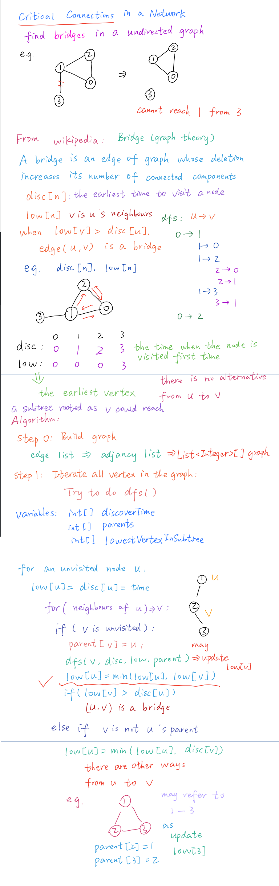

# LeetCode questions

## 2020.08.25

### 1192 Critical connection

#### My solutions

- [My solution 1](../Amazon/1192_critical_connection.java)

- [**My solution 2 best!**](../Amazon/1192_tarjan_dfs_critical_connection.java)

- [My solution 3 **My idea**](../Amazon/1192_critical_connection_solution3.java)

#### Online solutions

- [blog **best solution**](https://leetcode.jp/leetcode-1192-critical-connections-in-a-network-%E8%A7%A3%E9%A2%98%E6%80%9D%E8%B7%AF%E5%88%86%E6%9E%90/)

- [YouTube solution1](https://www.youtube.com/watch?v=kYcUIEQqL2Y)

- [YouTube solution2](https://www.youtube.com/watch?v=mKUsbABiwBI)

- [Tarjan algorithm](https://www.cnblogs.com/nullzx/p/7968110.html)

#### Steps

- 用临接表 adjancy list
  - List<Integer>[] graph
- Iterate all vertexs 
  - Try to do dfs()
  - Three variables:
    - int[] discoverTime
    - int[] parent
    - int[] lowestVertexInSubtree 
  - for unvisited node u
    - low[u] = disc[u] = time
    - for (neighbors of u) => v
    - if(v is not visited)
    - parent[v] = u
    - 递归调用，对v做dfs
    - 更新low[u] = min(low[u], low[v])
    - if(low[v] > disc[u]) -> edge(u, v) is critical connection

## 2020.09.02

### 957 Prison Cells After N Days 找规律

感觉没啥意义

#### [My solution](../Amazon/957_findPattern_prisonCellsAfterNDays.java) 

- 记录下每一步的state 
- 找到规律 例如：经过多少天就会形成 repetitive state
- 用给定step N mod C (我们找到的规律)
- N 对 C 取余数后找到对应state就是答案

#### Online solution

- [简单写法](https://massivealgorithms.blogspot.com/2019/01/leetcode-957-prison-cells-after-n-days.html)

